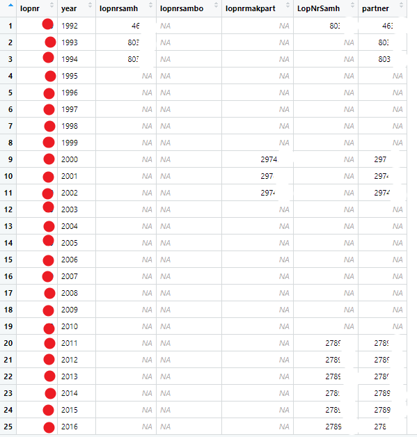
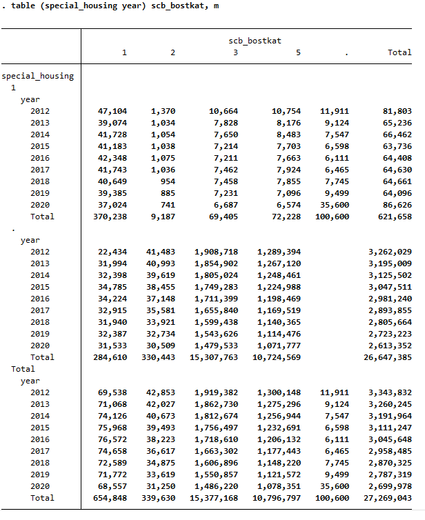
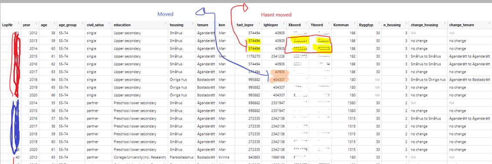

# Appendix

## Constructed variables

### Identifying partners {#partners}

Variable: __parnter__
location: clean/....

There are some discrepancies in the data when finding consistent partner matches to unique individuals across the multiple data sets. 

We can find partner data in two of the datasets: __partners_rtb__ and __samh__. In the __partners_rtb__ dataset, we have three variables for every lopnr-year observation:

*	Lopnrsamh – (no definition given in the excel sheet) 1987-1997.
*	Lopnrsambo – “sambo’s personummer” from 1998.
*	Lopnrmakpart – “make/maka/partners personummer” ( I believe this is technically married) from 1998.

From the __samh__ dataset, we have one variable:
*	LopNrSamh – (no definition given in the accompanying excel sheet).

Since no particular partner variable was consistent over time, a new varaible is created, “partner”,  that takes the value of whichever variable has valid data (of one of the above variables) for that lopnr/year.  If there are two values, the priority is for the lopnrsamh from the __partners_rtb__ dataset (it seems to have the best coverage).  

A screenshot for an particular individual with multiple partners over time to illustrate.

### Identifying change in kommun

Variable: __change_kommun__
location: clean/....

In the same fashion as identifying the change in a housing over time for an individual, we can observe when an individual has relocated outside of a geographical area when the geographical indicator changes. Variables may then be created to capture this trend.

### Identifying household size

Variable: __household_size__
location: clean/....

As size of household is not present in the data (number of individuals inhabiting a particular residence),
and estimate is constructed by the following combination of data items.
First, total number of children living at the residence is calculated by summing the items: barn_0_3, barn_4_6,barn_7_10_barn_11_15, and barn_16_17.
This estimate is augmented by 1 in the case of an individual living without a partner (no partner data available), or by 2 if a partner is living with that individual.
For example, an individual who has 2 children and living with a partner would have an calculated household size of 4 (2 children + 1 partner + 1 self)

### Identifying special housing

Variable: __special_housing__
location:

A particular housing situation in the context of healthy aging is that of special housing, taken to be composed predominantly of care home type housing options.
This attention has warranted a deeper look at how we can accurately identify whether or not an individual resides in a special housing. These are the considerations:

- Special housing may have entries in either the __municipal registers__ or the __Fastigehtsregister__.
- In the __municiple register__ we identify special housing when the variable __sbo__ is equal to __1__, or when the variable __boskat__ is equal to __2__.  We create a new variable, __special_housing__, when either one of these conditions are true.
- In the __Fastigehtsregister__ we identify special housing when the variable __scb_boskat__ is equal to __1__.

We can examine some cross tabulations of our new __special_housing__ variable ( from the municiple register) and the __scb_bostkat__ variable from Fastigehtsregister (which takes on the value of 1 when special housing)

### Number of visits {#visits}

#### Slutvård

Patient stays documented in the Slutvård data set are recorded in a manner which makes counting the number of stays in a particular period challenging.
Often is the case where a patient will check out on a particular date, and check back in on the exact same date.
While a cursory glance might lead one to conclude this phenomenon is the result of consecutive accidents or hospitalizations, the sheer number of occurrences of these back to back stays leads us to another conclusion - that when patients move from one ward to another, from the emergency room to the recovery ward for example, each record is recorded as a separate occurrence in the data set. 

Therefore these back-to-back observations are combined and counted as one visit under the assumption they represent the transfer of the patient from one ward or clinic to another.  Calculations and conclusions are treated as such.  To illustrate, in the above example, the we can see that the last two hospitalizations are back to back: the individual checks out on 09-30, then checks back in on the same date.

3 and 5 year rolling sums are estimated and stored in addition to the number of yearly stays.  Rolling sums are estimated over the 3(5) preceeding years, excluding the current year.  To account for gaps in the data (due to individuals not hospitalized every year), zeros are populated in gap years to facilitate accurate rolling sum calculations.

For example, the 3-year rolling sum of stays for an individual in 2016, would sum hospital stays for the years 2013, 2014, and 2015.

#### Openvård

Data pertaining to outpatient records are not plagued by the above back-to-back stays issue. Number of outpatient hospital visits is identified by counting the unique number of records per individual, per year.

3 and 5-year rolling sums are estimated in the same manner as done in the slutvård data.

## Identifying relocations 

To identify when an individual has relocated in the data the following considerations are taken into account.

* The housing variables, __fast_lopnr__ and __lghlopnr__ appear to uniquely identify the housing location of a particular individual.  Over time, a change in either variable should indicate that an individual as relocated (highlighted in orange below).  This change appears to be the best indicator of whether an individual has relocated or not. 

* The coordinate variables, __xkoord__ and __ykoord__ appear to be occasionally inconsistent, giving different values for the same  __fast_lopnr__ and __lghlopnr__ identifier in some of the data.  This may be the result of data errors or possibly a GPS margin of error when measuring housing location (Highlighted yellow).

*	The variable __n_housing__ counts how many unique __fast_lopnr__’s are associated with each __lopnr__.  For example, individual RED, has resided in three locations, Individual BLUE has resided in two locations, and Individual 40  has resided in one location during the sample period.

*	The variables __change_housing__  and __change_tenure__ take the before and after values of __housing__  and __tenure__ (respectively) and return the before and after categories when a change (relocation) has occurred.

*	__Byggtyp__ appears to follow the patterns of __fast_lopnr__ and __lghlopnr__, but contains some missing data.  The missing __Byggtyp__ value seems to be associated with the values “Övriga hus” and “Specialböstader” in __housing__. 

