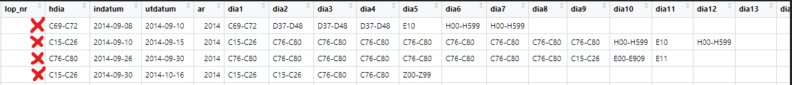
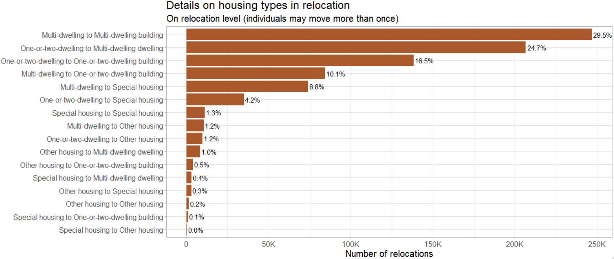

# Data Processing

## ICD codes.

Data files from Socialstyrelsen includes inpatient and outpatient data ranging from 1987 to 2020.
A particular area of interest in these data files is that of the reported International Classification of Diseases (ICD) codes reported by the physicians from  inpatient/outpatient visits.
Closely examining the ICD codes, it is possible to not only classify individuals into groups  according to specific risks (eg. high influenza risk),
but also to observe outcomes(contracts influenza).

This section documents the process of code extraction,
classification, data cleaning, and details in working with the ICD codes reported by Socialstyrelsen. 

### ICD Code types

There are a multitude of disease codes (ICD-10CM has around 70,000) which may differ slightly depending on which country uses them (18 different countries had national adoptions).
The classification system has changed over the years, from ICD 8, ICD 9, to the contemporary ICD 10.
ICD 11 is on the horizon.

The follow are points that are helpful to keep in mind when working with ICD codes:

* Single ICD codes may be reported in different formats and need to be standardized (eg. A12.2 may be reported as A122 or A12200)

* Similarly, upper and lower case is often mixed across the data tables(eg. a112.b and A112.B)

* ICD code chapters (Kapitel) or sections (Avsnitt) are often reported in place of an individual ICD code.
These are reported as a code range, such as "H00-H59", but may take on various iterations which make matching and identification challenging (eg. "H00-H590", H000-H590","H00-H599", "H00-H99". etc)

* ICD codes in the earlier years may need to be converted to ICD 10 for proper classification dependent on the time frame of analysis.

### Decoding the codes - matching

The approach taken to match ICD codes for further classification begins with identifying matches to the ICD code and code-ranges present in the Socialstyrelsen data with the corresponding definitions provided by Socialstyrelsen.
Here, the task is to construct a linking table containing every ICD code, ICD Kapitel, and ICD Avsnitt along with the corresponding definitions and to which risk group they belong to, if any.

This step is essential as much of the Socialstyrelsen data is reported in code ranges(eg. H00-H59),
while the ICD codes found in the risk categories are reported as single codes (eg. H12).
In constructing a linking table,
translation of any ICD codes found in a particular data set into useful groups and categories becomes a simple task which aid not only this study,
but any future study utilizing ICD codes.

In the creation of the linking table,
finding appropriate tables which list all Kapitel and Avsnitt ranges, across the variations of ICD-8, ICD-9, and ICD-10, proved challenging.
The final matching table utilized multiple tables downloaded from Socialstyrelsen in Excel format,
as well as tables only available in pdf format which required the manual extraction of code ranges to update the matching table.

### Data cleaning process

This section outlines the primary data cleaning and transformation steps taken to arrive at the final ICD data set.  Examples are taken from the data set on inpatient visits to illustrate the process.

First,
we can examine the data after some initial merging and standardization of variable names.

"lop_nr" is the unique patient identifier,
"indatum" and "utdatum" are dates of check-in and check-out,
"ar" is year of visit,
while "hdia" corresponds to "hud diagnosis" or primary diagnosis,
and variables "dia1" through "dia20" represent additional diagnosis codes.

Here we see patient "X" has had four inpatient hospital visits in 2014.  We can examine the second row and see the following:

* The main diagnosis (hdia) is given as "C15-C26" in this hospital visit, which is the same as Diagnosis 1 (dia1).  This pattern is most commonly seen in the data, where Diagnosis 1 is identical to the Primary diagnosis. 
* Additional diagnoses from the same visit can be seen across the columns dia1 through dia11.  Here we notice duplicates, presumably because there are multiple and unique diagnoses that fall within the reported range of value "C76-C80".

To further investigate the multiple ICD codes from these single visits,
it is helpful to transform the data from wide format to long format,
where each row represent a single ICD code.
This step facilitates the joining of descriptions and to classifications from the linking table and will prepare for subsequent analysis.

The following table shows the data after transforming from wide to long,
calculating the number of days per visit,
and matching a ICD definition to the code (or code range) that is present in the data to the linking table.
Duplicate ICD codes from the same visit are removed as they contain no further information.
A column documenting which specific source file the definition originates from is also included to trace specific definitions back to the corresponding Socialstyrelsen document or table.

Tables to match primarily originate from Socialstyrelsen and can be found here:

https://www.socialstyrelsen.se/statistik-och-data/klassifikationer-och-koder/icd-10/

## Flu risk categories

Research has identified particular medical conditions which significantly affect the chances of contracting influenza.  The following table represents the construction of flu risk categories based on ICD codes available in the data.

## Relocations
Study period 2012-2020 when data is made available from SCB from the Real estate and Apartment registers.  Data is taken from three SCB data sources: lev_lisa, lev_housing, and lev_population.  The following steps are taken to arrive at a complete data set:

* The unique identifier __lopnr__ in the lev_population data set is filtered with the following criteria: index_p ==1 & ater_pnr == 0 & sen_pnr == 1.

* Next this set of unique identifiers are matched to the full lev_lisa data set, resulting in lisa data that contains only the unique identifiers from the first step.

* 690 duplicate lopnr-year observations are identified and removed from the data set.  Further inspection indicated this small number is a result of messy data, showing no trend or further information.

* As data from lev_lisa ends in 2019 and data from the lev_housing data set ends in 2020, time invariant variables(year of birth, sex, education, etc.) from unique individuals in 2019 are replicated for 2020 to facilitate the appropriate matching to the unique identifiers in the 2020 Housing data. 

* Lastly, the data is joined by the unique lopnr-year combination with the lev_housing data.

### Descriptive statistics

Here we see that the vast majority of individuals who have relocated in the sample period have done so only once(82%),
with a small proportion moving 3 times or more (about 3%)

On the relocation level, we see that about 70% of revocations have been between some combination of Multi-dwelling and One-dwelling housing types, with a lower proportion of revocations into Special housing

Here, at the housing level, we can see that those in Special housing are mostly in the 85+ category.

## Specific data considerations

### Translating types of housing and tenure

(From Susanne):

___Hustyper och upplåtelseformer___

svenska/engelska

Med bostadslägenhet avses en lägenhet avsedd att helt eller till en inte oväsentlig del användas som bostad, oavsett i vilken hustyp den ligger.
Även bostäder i småhus definieras således som lägenheter. 
Upplåtelseform Lägenheternas upplåtelseform utgår från ägarförhållandet och inte hur de boende förfogar över lägenheterna

___Hustyp/Type of housing___

*	__Småhus__ avser friliggande en- och tvåbostadshus samt par-, rad- och kedjehus (exklusive fritidshus).
*	__One-or-two-dwelling buildings__ means detached buildings as well as semi-detached, row and linked buildings (excluding buildings for seasonal and secondary use).
*	__Flerbostadshus__ avser bostadsbyggnader innehållande tre eller flera lägenheter inklusive loftgångshus.
*	__Multi-dwelling buildings__ means buildings with three or more apartments including balcony access housing.
*	__Övriga__ hus avser byggnader som inte huvudsakligen är avsedda för bostadsändamål men ändå innehåller bostadslägenheter, t.ex. byggnader avsedda för verksamhet/samhälls¬funktion.
*	__Other housing__ means buildings that are not mainly intended for residential purposes but still contains ordinary dwellings, e.g. buildings used for business/public function.
*	__Specialbostäder__ avser bostäder för äldre/funktionshindrade, studentbostäder, etc.
*	__Special housing__ means dwellings for older people, persons with disabilities, students, etc.

___Upplåtelseform___

*	__Hyresrätt__: Flerbostadshus och övriga hus med hyresrätt avser lägenheter som inte är ägarlägenheter och som ägs av andra än bostadsrättsföreningar/bostadsföreningar. Småhus med hyresrätt avser lägenheter som ägs av andra ägare än fysiska personer, dödsbon, bostadsrättsföreningar/bostadsföreningar.
*	__Rented dwellings__: Multi-dwelling and other buildings with dwellings that are owned by other than housing cooperatives. One- or two-dwelling buildings with rented dwellings means apartments owned by other than private persons, estates of deceased persons or housing cooperatives.
*	__Bostadsrätt__: Bostadsrätt avser lägenheter som ägs av bostadsrättsföreningar/ bostadsföreningar (äldre form som existerade innan 1930).
*	__Tenant-owned dwelling__: One-, two- or multi-dwellings owned by housing cooperatives.
*	__Äganderätt__: Småhus med äganderätt avser lägenheter som ägs av fysiska personer eller dödsbon. Flerbostadshus och övriga hus med äganderätt avser ägarlägenheter.
*	__Owner-occupied dwelling__: One- or two-dwelling buildings with apartments owned by private persons or estates of deceased persons. Multi-dwelling and other buildings with owner-occupied dwelling means condominiums.

Källa SCB, bearbetat av Susanne, 2022-09-08

Fotnot SCB:
Både nyproducerade och existerande lägenheter, vilka tidigare utgjort bortfall i registret, registreras löpande. Därutöver sker rättningar och kompletteringar av tidigare felaktiga uppgifter samt till följd av att det befintliga beståndet förändras, t.ex. genom ombyggnad och rivning. Största delen av de lägenheter som redovisas som specialbostäder och övriga hus från 2013 och framåt ingick tidigare i kategorin flerbostadshus.

