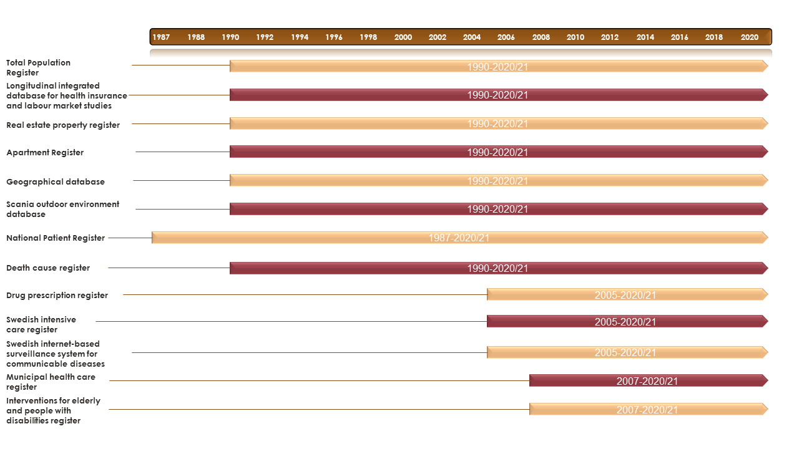

# Overview of Registers and Data

The study period in Register RELOC-AGE ranges from 1990-2020 and is comprised of 13 registers with staggered coverage which is illustrated below. 

More information on the registers used in the study is provided below.

## Total Population Register (TPR)

- **Swedish Name**: [Swedish name]
- **Description**: Sex; birth date; civil status (duration, dates, changes); address (dates, changes); income; country of origin; citizenship; in-/emigration (dates); number of people in the dwelling; housing tenure; socioeconomic indicators of the neighborhoods (on postal code, municipal levels)
- **Time Period**: 1968
- **Key Variables**:
  - Sex
  - Birth date
  - Civil status (duration, dates, changes)
  - Address (dates, changes)
  - Income
  - Country of origin
  - Citizenship
  - Immigration and emigration dates
  - Number of people in the dwelling
  - Housing tenure
  - Socioeconomic indicators of neighborhoods
- **Data Provider**: Statistics Sweden
- **Link**: [Link to register details](https://example.com)

---

## National Patient Register (NPR)

- **Swedish Name**: Patientregistret (PAR)
- **Description**: The Patient Register provides the basis for statistics on diseases and treatments in Swedish specialized care. Data from the Register are used to generate statistics on, for example, compulsory psychiatric care, injuries and poisonings as well as waiting times in emergency departments.

- **Time Period**: 1987-2020
- **Key Variables**:
  - Total number of hospitalizations per month
  - In-patient health outcomes (ICD-10 chapters such as falls, fractures, stroke, etc.)
- **Data Provider**: Socialstyrelsen
- **Link**: [Link to register details](https://www.socialstyrelsen.se/statistik-och-data/register/patientregistret/)

---

## Real Estate Property Register (REPR)

- **Swedish Name**: [Swedish name]
- **Description**: Objective housing characteristics for each dwelling: type of dwelling; price of dwelling; type of tenure; size; presence of stairs/elevator; floor; building and construction year; characteristics of the neighborhood: communal facilities (e.g., roads), green areas; date of each relocation
- **Time Period**: 1908
- **Key Variables**:
  - Type of dwelling
  - Price of dwelling
  - Type of tenure
  - Size
  - Presence of stairs/elevator
  - Floor
  - Building and construction year
  - Neighborhood characteristics (communal facilities, green areas)
  - Date of each relocation
- **Data Provider**: Swedish Mapping, Cadastral, and Land Registration Authority
- **Link**: [Link to register details](https://example.com)

---

## Geographical Database (GD)

- **Swedish Name**: [Swedish name]
- **Description**: DESO (demographical statistical unit); coordinates of the housing and address, etc.
- **Time Period**: 1952
- **Key Variables**:
  - DESO (demographic statistical unit)
  - Coordinates of the housing and address
- **Data Provider**: Statistics Sweden
- **Link**: [Link to register details](https://example.com)

---

## Death Cause Register (DR)

- **Swedish Name**: Dödsorsaksregistret (DORS)
- **Description**: The National Cause of Death Register provides the basis for official cause-of-death statistics in Sweden. The Register's data are also used to describe the health of the population, as a basis for health care interventions and for research.

- **Time Period**: 1990-2020
- **Key Variables**:
  - Death cause
  - Date of death
- **Data Provider**: Socialstyrelsen
- **Link**: [Link to register details](https://www.socialstyrelsen.se/statistik-och-data/register/dodsorsaksregistret/)

---

## Longitudinal Integrated Database for Health Insurance and Labour Market Studies (LISA)

- **Swedish Name**: [Swedish name]
- **Description**: Education level, income, social insurance
- **Time Period**: 1990
- **Key Variables**:
  - Education level
  - Income
  - Social insurance
- **Data Provider**: Statistics Sweden
- **Link**: [Link to register details](https://example.com)

---

## Drug Prescription Register (DPR)

- **Swedish Name**: [Swedish name]
- **Description**: Drug prescriptions for chronic illnesses (ATC code, dose, and date): endocrine; cardiovascular; hepatic; renal or neurological/neuromuscular
- **Time Period**: 2005
- **Key Variables**:
  - ATC code
  - Dose
  - Prescription date
- **Data Provider**: National Board of Health and Welfare
- **Link**: [Link to register details](https://example.com)

---

## Swedish Intensive Care Register (SIRI)

- **Swedish Name**: [Swedish name]
- **Description**: Intensive care for laboratory-confirmed influenza and (since 2020) COVID-19.
- **Time Period**: 2001
- **Key Variables**:
  - Intensive care for laboratory-confirmed influenza
  - Intensive care for COVID-19 (since 2020)
- **Data Provider**: Swedish Intensive Care Registry
- **Link**: [Link to register details](https://example.com)

---

## Swedish Internet-Based Surveillance System for Communicable Diseases (SmiNet)

- **Swedish Name**: [Swedish name]
- **Description**: Laboratory-confirmed influenza and (since 2020) COVID-19
- **Time Period**: 1997 and since 2004 for COVID-19
- **Key Variables**:
  - Laboratory-confirmed influenza
  - Laboratory-confirmed COVID-19 (since 2020)
- **Data Provider**: Public Health Agency of Sweden
- **Link**: [Link to register details](https://example.com)

---

## Municipal Health Care Register (MHCR)

- **Swedish Name**: Registret över insatser inom kommunal hälso- och sjukvård (HSL)
- **Description**: The Register contains information on all persons who have received health care for which the municipality is responsible under the Health and Medical Services Act. The Register covers around 400,000 people per year.
Until 2018, the Register included only information on persons who have received any intervention in the municipal health care system, broken down per calendar month. From 2019, the Register is supplemented by information on which patient-related procedures were carried out by authorised staff with the municipality as the care provider. Procedures are classified at the most detailed level of the Classification of Health Care Procedures (KVÅ). In addition, municipalities provide information regarding the date on which the procedure was performed and by which authorised professional group. From 2019 onwards, all data are provided to the Register on a monthly basis.
Home help and service type and number of hours/month/year: escorting, replace the relative, personal care, meal delivery, security alarm, daytime activities; short-term vs. long-term.
- **Time Period**: 2007-2020
- **Key Variables**:
  - Care received
  - Date of care
- **Data Provider**: Socialstyrelsen
- **Link**: [Link to register details](https://www.socialstyrelsen.se/statistik-och-data/register/kommunal-halso-och-sjukvard/)

---

## Interventions for Elderly and People with Disabilities Register (IEPDR)

- **Swedish Name**: Registret över insatser till äldre och personer med funktionsnedsättning (SOL)
- **Description**: The Register covers the elderly and persons with physical, mental or intellectual impairments who receive municipal care under the Social Services Act. The Register contains data on about 400,000 people per data collection. It only concerns decisions that have been implemented (previously, all decisions made were included, but this was changed in 2012). The Register does not contain information on the number of registered places in nursing homes.

- **Time Period**: 2007-2020
- **Key Variables**:
  - Home help and service type
  - Hours of care per month/year
  - types of care: escorting, replace the relative, personal care, meal delivery, security alarm, daytime activities.
  - Short-term vs. long-term care
  
- **Data Provider**: Socialstyrelsen

- **Link**: [Link to register details](https://www.socialstyrelsen.se/statistik-och-data/register/aldre-och-personer-med-funktionsnedsattning/)

---

## Apartment Register (AR)

- **Swedish Name**: [Swedish name]
- **Description**: Dwelling type; number of rooms; dwelling unit size; kitchen type
- **Time Period**: 2012
- **Key Variables**:
  - Dwelling type
  - Number of rooms
  - Dwelling unit size
  - Kitchen type
- **Data Provider**: Swedish National Board of Housing, Building and Planning
- **Link**: [Link to register details](https://example.com)

---

## Scania Outdoor Environment Database (ScOut)

- **Swedish Name**: ScOut
- **Description**: To be able to study the effects and complexity of multiple perceived outdoor environment characteristics on health and well-being and reduce single-source bias, we compiled a database based on the available resources in Scania, southern Sweden, 2008–2019, including area-aggregated assessments of 24 characteristics. We found that PSDs were robust to seasonal changes. We observed clear visible patterns between different characteristics, with correlations between them ranging from negligible to strong, confirming the complexity of the perceived environment. ScOut is a unique data source in its nature and size, in Sweden and abroad, covering areas where approximately 97% of the population live.

- **Time Period**: See link for details
- **Key Variables**: See link for details
- **Data Provider**: See link for details
- **Link**: [Link to register details](https://www.sciencedirect.com/science/article/pii/S0013935122023350?via%3Dihub)
